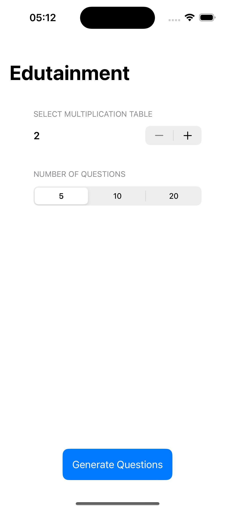
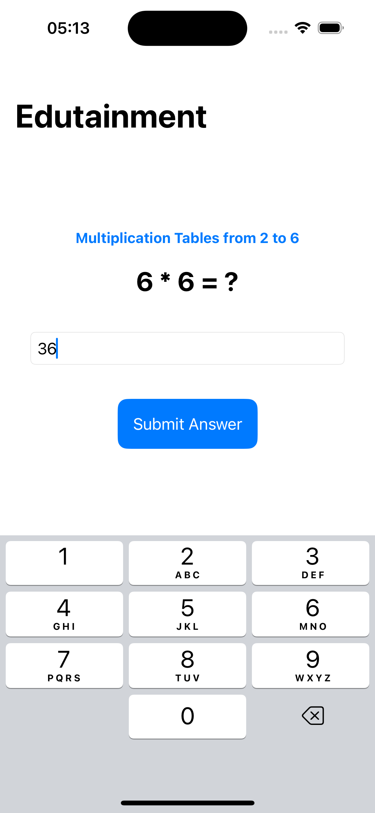
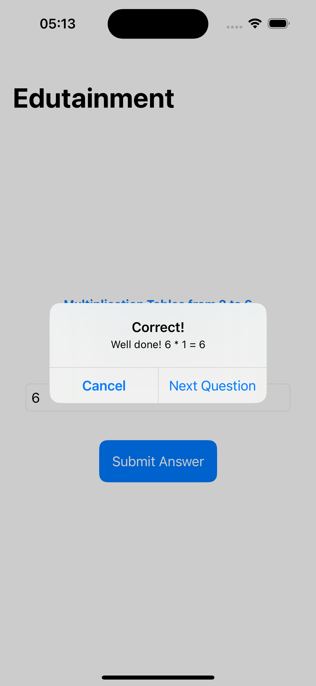

# Edutainment

Edutainment is a SwiftUI-based educational app designed to help users practice multiplication tables in a fun and interactive way. The app allows users to select a multiplication table and the number of questions they want to attempt, then provides a series of questions for them to answer.

## Features

- **Select Multiplication Table**: Choose a multiplication table from 2 to 12.
- **Select Number of Questions**: Choose from 5, 10, or 20 questions per session.
- **Interactive Questioning**: Answer multiplication questions and receive immediate feedback.
- **Score Tracking**: Keep track of your score throughout the session.
- **Animations**: Smooth transitions between different states of the app for an engaging user experience.

## Getting Started

### Prerequisites

- **Xcode**: Make sure you have Xcode installed on your Mac.
- **iOS Simulator or Device**: You'll need either an iOS simulator or a physical iOS device to run the app.

### Installation

1. **Clone the Repository**:
   ```bash
   git clone https://github.com/OmPreetham/Edutainment.git
   ```
2. **Open the Project**:
   Navigate to the project directory and open `Edutainment.xcodeproj` in Xcode.
   ```bash
   cd edutainment
   open Edutainment.xcodeproj
   ```
3. **Run the App**:
   Select the target device or simulator and click the run button in Xcode.

## Usage

1. **Welcome Screen**:

   - Select the multiplication table you want to practice using the stepper.
   - Choose the number of questions you want to answer using the segmented picker.
   - Press the "Generate Questions" button to start the quiz.

2. **Answer Questions**:

   - A multiplication question will be displayed.
   - Enter your answer in the text field and press "Submit Answer".
   - You will receive feedback on whether your answer is correct or incorrect.
   - Proceed to the next question or end the game based on your choice.

3. **End of Game**:
   - At the end of the session, your score will be displayed along with the total number of questions answered.
   - Press "New Game" to start a new session.

## Code Structure

- **ContentView.swift**: Main view containing the entire game logic and UI.
- **State Variables**: Manage the state of the game including selected table, question count, current question, user answers, score, and game status.
- **Functions**:
  - `generateQuestion()`: Generates a new multiplication question.
  - `answerQuestion()`: Checks the user's answer and updates the score.

## Screenshots





## Contributions

Contributions are welcome! If you have suggestions for improvements or new features, feel free to fork the repository and submit a pull request.

## License

This project is licensed under the MIT License - see the [LICENSE](LICENSE) file for details.

## Acknowledgments

- Thanks to the Swift and SwiftUI community for their excellent resources and support.
- **Hacking with Swift** for providing the project inspiration.
- Inspired by educational apps that make learning fun and interactive.
